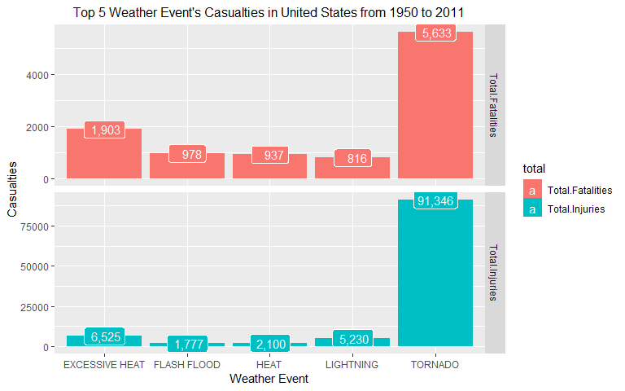
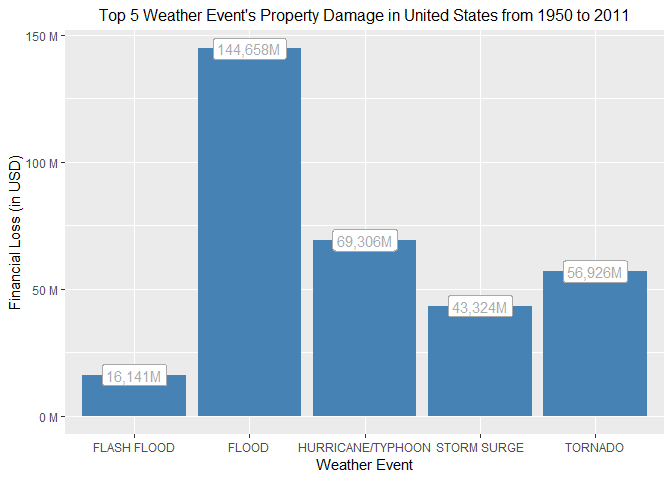
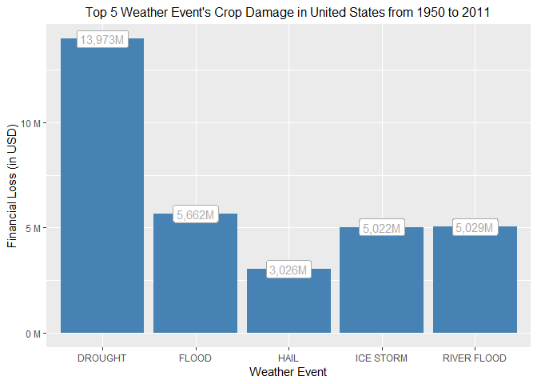

# Synopsis  
Storms and other severe weather events can cause both public health and economic problems for communities and municipalities. Many severe events can result in fatalities, injuries, and property damage, and preventing such outcomes to the extent possible is a key concern.

This project involves exploring the U.S. National Oceanic and Atmospheric Administration's (NOAA) storm database to explain the impact of  weather events towards public health and the economy.

# Data Processing  
**Importing Data**  
The data set for the analysis was obtained from U.S. National Oceanic and Atmospheric Administration's (NOAA) storm database.  

**Data Cleaning Notes**  
* Transformed PROPDMGEXP and CROPDMGEXP into numeric character.   
* Multiplied PROPDMG to PROPDMGEXP and CROPDMG to CROPDMGEXP.


```r
library(tidyverse)
library(ggplot2)

# 1. Importing the data set
StormData <- read.csv("StormData.csv.bz2")

# 2. Tidying data set
StormData$PROPDMGEXP <- as.numeric(ifelse(StormData$PROPDMGEXP == "K", 1000, 
                                          ifelse(StormData$PROPDMGEXP == "M", 1000000,
                                                 ifelse(StormData$PROPDMGEXP == "B", 1000000000, 0))))
StormData$PROPDMG <- StormData$PROPDMG * StormData$PROPDMGEXP

StormData$CROPDMGEXP <- as.numeric(ifelse(StormData$CROPDMGEXP == "K", 1000, 
                                          ifelse(StormData$CROPDMGEXP == "M", 1000000,
                                                 ifelse(StormData$CROPDMGEXP == "B", 1000000000, 0))))
StormData$CROPDMG <- StormData$CROPDMG * StormData$CROPDMGEXP
```


# Result  
## **Weather Events Impact on Population Health**  
**Analysis Steps**  
* Grouped NOAA data set by EVTYPE variable into new data set.  
* Summaries total number of FATALITIES and INJURIES and sort descending from that two variables.  
* Select the top 5 EVTYPE.  
* Plot the data set.  


```r
casualties <- StormData %>%
        group_by(EVTYPE) %>%
        summarise(Total.Fatalities = sum(FATALITIES), 
                  Total.Injuries = sum(INJURIES)) %>%
        arrange(desc(Total.Fatalities), desc(Total.Injuries))

casualties_top5 <- head(casualties, 5)
casualties_top5 <- casualties_top5 %>%
        gather(total, values, -EVTYPE)

ggplot(data = casualties_top5, aes(x = EVTYPE, y = values, fill = total, label = format(values, big.mark = ","))) +
        geom_col(position = "dodge") +
        facet_grid(total ~ ., scales = "free") +
        geom_label(color = "white", label.size = 0.1) +
        ggtitle("Top 5 Weather Event's Casualties in United States from 1950 to 2011") +
        xlab("Weather Event") +
        ylab("Casualties") + 
        theme(plot.title = element_text(size = 12, hjust = 0.5))
```

<!-- -->


**Insight**  
Tornado is the most dangerous weather event in United States, with the highest number in fatalities and injuries.

## **Weather Events Impact on Economy**
**Analysis Steps**  
* Grouped NOAA data set by EVTYPE variable into two data sets.  
* Summaries and sort each data set.  
* Select the top 5 EVTYPE for each data set.  
* Plot the data sets.  

***By Property Damage***

```r
PropertyDamage <- StormData %>%
        group_by(EVTYPE) %>%
        summarise(Property.Damage = sum(PROPDMG)) %>%
        arrange(desc(Property.Damage))
PropertyDamage <- head(PropertyDamage, 5)
ggplot(data = PropertyDamage, aes(x = EVTYPE, y = Property.Damage, 
                                  label = paste0(format(round(Property.Damage / 1e6), 
                                                        trim = TRUE, big.mark = ","), "M"))) +
        geom_col(position = "dodge", fill = "steelblue") + 
        ggtitle("Top 5 Weather Event's Property Damage in United States from 1950 to 2011") +
        xlab("Weather Event") +
        ylab("Financial Loss (in USD)") + 
        theme(plot.title = element_text(size = 12, hjust = 0.5)) +
        scale_y_continuous(labels = scales::unit_format(unit = "M", scale = 1e-9)) + 
        geom_label(color = "Dark Gray")
```

<!-- -->


***By Crop Damage***

```r
CropDamage <- StormData %>%
        group_by(EVTYPE) %>%
        summarise(Crop.Damage = sum(CROPDMG)) %>%
        arrange(desc(Crop.Damage))
CropDamage <- head(CropDamage, 5)

ggplot(data = CropDamage, aes(x = EVTYPE, y = Crop.Damage, 
                                  label = paste0(format(round(Crop.Damage / 1e6), 
                                                        trim = TRUE, big.mark = ","), "M"))) +
        geom_col(position = "dodge", fill = "steelblue") + 
        ggtitle("Top 5 Weather Event's Crop Damage in United States from 1950 to 2011") +
        xlab("Weather Event") +
        ylab("Financial Loss (in USD)") + 
        theme(plot.title = element_text(size = 12, hjust = 0.5)) +
        scale_y_continuous(labels = scales::unit_format(unit = "M", scale = 1e-9)) + 
        geom_label(color = "Dark Gray")
```

<!-- -->

**Insight**  
* Biggest financial loss in property damage caused by flood.  
* Crop damage from drought is the highest.  
